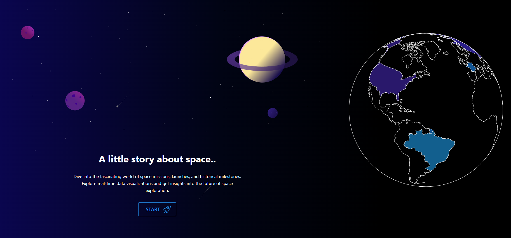
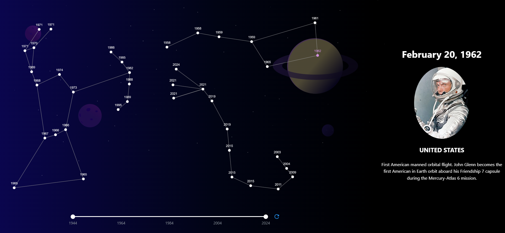
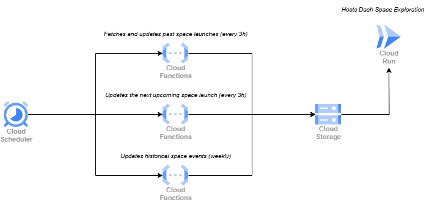

# 🚀 Space App

An interactive dashboard developed with Dash by Plotly, providing **real-time** and historical insights on space exploration. The dashboard **autonomously updates multiple datasets through a fully automated pipeline of Google Cloud Functions and scrapers**, ensuring the information is always up-to-date without any manual intervention.

🎥 **[Watch the demo video here](https://youtu.be/2rO7on8kaW4?si=nAtkzaNwbZTvvTnW)**  

This is the **local deployment** branch. The project also supports **AWS** and **GCP deployments**, with the necessary configuration files available in their respective branches.

- **Local deployment:** `master` branch  
- **AWS deployment:** `aws-deployment` branch  
- **GCP deployment:** `gcp-deployment` branch  

## 🖥 Dashboard Preview

## ⚙️ Automated Pipeline

The GCP deployment is fully automated via Cloud Run and Cloud Functions. The update workflow is as follows:

    

## 🔄 Data Sources

These datasets are maintained by three independent scrapers:

- 🚀 [NextSpaceFlight Scraper](https://github.com/Tanguy9862/NextSpaceFlight-Scraper) (Past launches)  
- 🛰 [Next Launch Scraper](https://github.com/Tanguy9862/Next-Launch-Scraper) (Upcoming launch)  
- 🌍 [Wikipedia Space Scraper](https://github.com/Tanguy9862/Wikipedia-Space-Scraper) (Historical events)

## 🛠️ Installation & Setup
The system is designed for flexibility in deployment:
- **Local Setup:** Clone the repository, install dependencies from `requirements.txt`, and run locally.
- **Cloud Deployment:** For deploying on Google Cloud Platform (GCP) or Amazon Web Services (AWS), modify the `user_config.py` to fit your configurations. Ensure appropriate permissions are set.

If you need to configure the application for a specific environment, check the corresponding branches:
- **AWS Configuration**: Branch [`env/aws-config`](https://github.com/Tanguy9862/Space-App/tree/env/aws)
- **GCP Configuration**: Branch [`env/gcp`](https://github.com/Tanguy9862/Space-App/tree/env/gcp)
